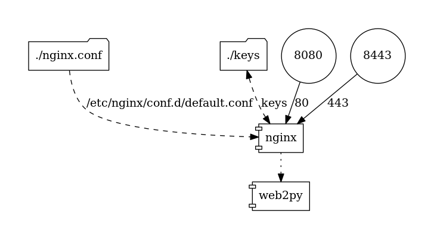

# Web2py Docker Image
This image combines Web2py and uWSGI into one flexible image.  It supports 3 modes: HTTP via Web2py, HTTP via uWSGI or the uwsgi protocol.

## Getting started
To run a simple example using HTTP:
```
docker run -p 8080:8080 smithmicro/web2py
```
Then open a web browser to:  http://localhost:8080

## Features
* Supports the HTTP protocol to support standalone testing.
* Supports uWSGI to be used in conjuntion with a web server such as nginx.
* Image offloads concerns for HTTPS to another container, such as nginx.  This simplifies the Web2py container and makes it general purpose.
* Applications can be added by a volume map to /opt/web2py/applications/appname

## Command Line Options

|command|port|protocol|notes|
|-------|----|--------|-----|
|http   |8080|`http://` |Using uWSGI in HTTP mode (default)|
|uwsgi  |9090|`uwsgi://`|Useful for connecting to a reverse proxy like nginx|
|rocket |8080|`http://` |Uses the built in Web2py Rocket web server|

Example:
```
docker run -it -p 8080:8080 smithmicro/web2py rocket
```

## Docker Environment Variables

|command|operation|default|
|-------|---------|-------|
|WEB2PY_VERSION |Use a specific version of Web2py | empty (current version).  Not supported in Alipine image. |
|WEB2PY_PASSWORD|Set the adminitrative password | empty |
|WEB2PY_ADMIN_SECURITY_BYPASS|Bypasses HTTP secuirty check for the Admin application.  WEB2PY_PASSWORD must also be set. | empty (false) |
|UWSGI_OPTIONS|Set command line options for uwsgi.  Used for `http` and `uwsgi` commands.|--master --thunder-lock --enable-threads|

## nginx example
To use the adminstration functions of web2py, you will need an SSL connection.
This can be achived by using the docker-compose.yml file at the root.
Run the following:

```
cd keys
./create-keys.sh
cd ..
docker-compose up
```

Steps:
* Visit: https://localhost:8443
* You will need to accept the browser warning of an unsafe site.
* Press the `admin` button
* Enter `password` as the password to see the admin site.



## Application Example
You can expose an application from the host into the container using a volume map.  This Docker Compose example maps an applicaiton folder called `myapp` and sets the default route:

```
version: '2'

services:
  app:
    image: smithmicro/web2py:alpine
    volumes:
      - ./myapp:/opt/web2py/applications/myapp
      - ./routes.py:/opt/web2py/routes.py
    ports:
      - 8080:8080
```
routes.py would look like this:
```
# -*- coding: utf-8 -*-

default_application = 'myapp'
```

## Administration Example
By default, W2b2py requires the user to use HTTPS or connect from 127.0.0.1 in order to use the admin application.  The tests for 127.0.0.1 do not work inside a container as the connecting browser comes from 172.x.x.x via the Docker Bridge Network.

To workaround this, you can use the `WEB2PY_ADMIN_SECURITY_BYPASS` environment variable and set it to `true`.  You also need to set the `WEB2PY_PASSWORD` variable.  To see this in action, run the example in the debian folder:
```
cd debian
docker-compose up
```
* Visit: http://localhost:8080/admin
* Enter `password` as the password to view the admin site.

## Customizing the Image
To add Python packages required by your application, create a `Dockerfile` like this.  Make sure you switch to the `root` user, and then back to the `web2py` user after installing your application and any required Python packages.

```
FROM smithmicro/web2py

USER root

# Copy my applications to the image
COPY applications $WEB2PY_ROOT/applications/

# Install required Python pacakages, remove sample apps and set proper ownership
RUN pip install fileutils pillow requests \
 && rm -rf $WEB2PY_ROOT/applications/welcome $WEB2PY_ROOT/applications/examples \
 && chown -R web2py:web2py $WEB2PY_ROOT

USER web2py
```

## Useful Links
[Web2py Web Site](http://www.web2py.com/)

[Install uWSGI on CentOS](http://uwsgi-docs.readthedocs.io/en/latest/Install.html)

[Split uWSGI and nginx into 2 microservices](https://medium.com/@greut/minimal-python-deployment-on-docker-with-uwsgi-bc5aa89b3d35)

[Configuring uWSGI](http://uwsgi-docs.readthedocs.io/en/latest/Configuration.html)
